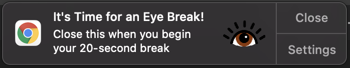

# 20-20-20

## Description

20-20-20 is a chrome extension that reminds you to practice the [opthamologist recommendation](https://advancedeyecaremd.net/20-20-20-tipstopreventeyestrain/) that we look at something 20 feet away, every 20 minutes, for 20 seconds to prevent eye strain during long periods of screen use. 

## Screenshot    

Screenshot incoming!
 

## Usage

Install as you would any other Chrome extension:
[General extension installation instructions](https://support.google.com/chrome_webstore/answer/2664769?hl=en)
Link to 20-20-20 incoming!

## Built With

JavaScript, HTML, JSON, CSS, Chrome APIs. Graphics designed in Affinity Designer

## Acknowledgement 

Thanks to Google for getting me hooked on Chrome extensions with these simple and thorough instructions: [making your first extension](https://developer.chrome.com/docs/extensions/mv3/getstarted/). Many thanks to the various answers on [stackoverflow](https://stackoverflow.com/) that helped me along the way. 

## Progress

### Phase 2 - complete basic functionality:
- [x] make notifications appear via a timer instead of button-on-dom
- [x] when notification is closed, restart timer
- [x] display timer count on popup
- [x] display a message on the popup

### Phase 3 - styling and UX:
- [x] add more instructions/feedback for user: e.g. when 'take a break' is clicked, should include a note about how to do 20-20-20, then *wait 20 sec*, then start the 20 min timer. 
- [ ] add title and logo to popup and style
- [ ] add description to popup and style
- [ ] style popup button

### Phase 4 - polish and additional features:
- [ ] display some stat on the popup - how many times has user taken 20-20-20 breaks? streaks?
- [ ] add a pause button - see toucan toggle
- [ ] add link to 20-20-20 info in popup

### Stretch goals
- [ ] expand functionality for other types of breaks - stretching, water, exercise, sit/stand desk, etc?
